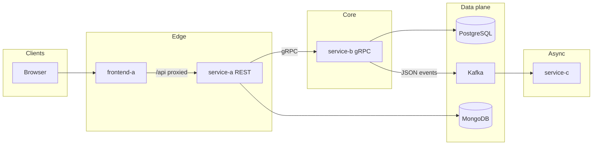
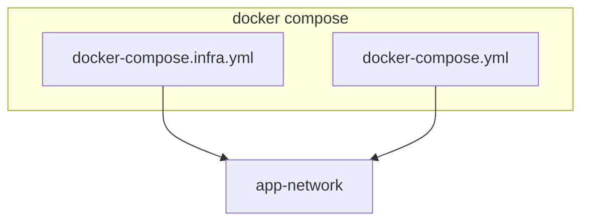

# Architecture

This document describes how the **easy-devops-tutorial** system is structured: runtime components, how they talk to each other, where state lives, and how contracts are shared. For standards and folder layout, see [OVERALL.md](OVERALL.md). For HTTP paths, gRPC services, and Kafka message shapes, see [API.md](API.md). For ports, quick start, and CI, see the [root README](../README.md). For IaC, Makefile, E2E checks, and quality commands, see [INFRASTRUCTURE.md](INFRASTRUCTURE.md).

---

## Goals

- **Polyglot services** with clear boundaries: Node (edge), Go (domain + auth), Python (async consumption).
- **Contract-first internal API**: gRPC + Protocol Buffers under `services/common/protos`.
- **Environment-driven wiring**: hosts, topics, and secrets come from configuration (see `.env.example`), not hardcoded URLs in application code.

---

## System context

External users and operators reach the stack through HTTP. The admin SPA talks to the REST gateway; browsers do not call Service-B’s gRPC port directly in the default Docker layout.



**Storybook-only UIs** (`frontend-b`, `frontend-c`) are component libraries served as static sites; they are not wired into the gateway in Compose. **Service-C** has no HTTP API; it only consumes Kafka.

---

## Components

| Component | Runtime | Responsibility |
|-----------|---------|----------------|
| **service-a** | Node.js 20, TypeScript, Express | Public REST API; maps JSON ↔ gRPC; writes **audit logs** to MongoDB on successful mutating/list operations (see [API.md](API.md)). |
| **service-b** | Go 1.22, gRPC | **AuthService**, **UserService**, **RoleService**; PostgreSQL persistence; JWT access tokens and server-side refresh tokens; **Kafka producer** for domain events. |
| **service-c** | Python 3.11, aiokafka | Subscribes to Kafka topics (by default discovers non-internal topics); logs and processes records; stateless. |
| **frontend-a** | Vite SPA behind nginx | Admin UX: login, JWT in `localStorage`, user/role management (RBAC), audit log viewer, link to Kafka UI. Proxies `/api` to service-a in Docker. |
| **frontend-b** / **frontend-c** | Storybook | Presentational components and docs; not part of the request path for the live API. |

---

## Communication patterns

### Synchronous: REST → gRPC

1. Client sends HTTP to **service-a** (or via **frontend-a** `/api` proxy).
2. **service-a** invokes **service-b** using `@grpc/grpc-js` and protobuf stubs generated from shared `.proto` files.
3. Protected routes forward `Authorization: Bearer <access>` as gRPC metadata; **service-b** enforces authentication and role checks.

Validation of RPC payloads is implemented in **service-b** handlers (see note in [API.md](API.md)).

### Asynchronous: Kafka

- **service-b** publishes **JSON** domain events to configurable topics (defaults **`user.events`** and **`role.events`**), after successful state-changing operations as described in [API.md](API.md).
- **service-c** consumes from those topics (and optionally others if discovery is enabled). Producer and consumer share **topic names** and **JSON schema** by convention; the on-wire format is not protobuf.

### Audit trail (MongoDB)

- **service-a** persists audit rows to **MongoDB** for observability of gateway usage. Failed audit writes are logged but do not fail the primary HTTP response (see [API.md](API.md) troubleshooting).

---

## Shared contracts

| Concern | Location | Consumers |
|---------|----------|-----------|
| gRPC / Protobuf | `services/common/protos` (`auth/v1`, `user/v1`, `role/v1`) | service-a (stubs), service-b (`buf generate` → `internal/genpb`) |
| Tooling | `services/common` Buf config, CI `proto.yml` | Lint, format, build, breaking checks on PRs |

Changes flow **proto first**, then regenerate Go code; service-a’s build copies or references the same proto tree as configured by `USER_PROTO_ROOT`.

---

## Data ownership

| Store | Owner | Content |
|-------|-------|---------|
| **PostgreSQL** | service-b | Users, roles, refresh tokens, password reset tokens, relational integrity. |
| **MongoDB** | service-a | Audit log documents (`AuditLog` collection / `auditlogs` usage per deployment). |
| **Kafka** | Infrastructure | Durable log of domain events; no single service “owns” the broker, but **service-b** is the application producer and **service-c** a consumer. |

---

## Deployment topology (Docker Compose)

- **`docker-compose.yml`** `include`s **`docker-compose.infra.yml`**: one logical stack.
- All application and infra containers attach to the bridge network **`app-network`** (`name: app-network`).
- **Service discovery** uses Docker DNS (`service-b`, `kafka`, `mongodb`, `postgres`, etc.).
- **kafka-init** ensures topics exist before producers/consumers rely on them.
- **Kafka** exposes an **internal** listener (`kafka:9092`) for containers and an **external** listener on the host (default `localhost:9094`) for host-side tools; see [README.md](../README.md).
- **PostgreSQL and MongoDB** use Compose **named volumes** (`postgres_data`, `mongodb_data`). The optional IaC overlay [`docker-compose.iac.yml`](../docker-compose.iac.yml) attaches those volumes to **Terraform-managed** external names; see [infrastructure/README.md](../infrastructure/README.md).

### Optional IaC layering (Terraform, Puppet, Ansible)

- **Terraform** (`infrastructure/terraform`): creates Docker **network** `app-network` and **named volumes** for Postgres/Mongo data before Compose when using the overlay.
- **Puppet** (`infrastructure/puppet`): Hiera-driven **topic catalog** and env fragments under `infrastructure/generated/` (apply via Dockerized `puppet-agent`).
- **Ansible** (`infrastructure/ansible`): `docker compose` (with or without overlay), **Kafka topic** creation from the catalog (`kafka-topics.sh --if-not-exists`), and **HTTP health** checks. Compose remains the **canonical container graph**; IaC tools split primitives, policy/config, and orchestration.



---

## Security model (summary)

- **service-b** issues **HS256** JWT access tokens; **JWT_SECRET** must be set appropriately in production.
- **Roles** (e.g. `user`, `admin`) gate management RPCs; the gateway mirrors that behavior for REST.
- Bootstrap and demo accounts are optional seed data controlled by environment variables (see [README.md](../README.md)).

Details: [API.md](API.md) — Authentication section.

---

## Observability

- **HTTP health**: `GET /health` on service-a.
- **Audit API**: `GET /audit-logs` (admin-only) backed by MongoDB.
- **Kafka UI**: optional UI container on port **8080** by default to inspect topics and lag.
- **Logs**: `docker compose logs` for each service; service-c logs consumed messages.

---

## Repository map (architecture-relevant)

```
services/
  service-a/     # REST gateway, Mongo audit
  service-b/     # gRPC, Postgres, Kafka producer
  service-c/     # Kafka consumer worker
  frontend-a/    # Admin SPA + nginx proxy
  frontend-b/    # Storybook (log UI components)
  frontend-c/    # Storybook (user UI components)
  common/protos/ # gRPC contracts
infrastructure/  # Terraform (Docker net/volumes), Puppet (generated catalog), Ansible (deploy + Kafka topics)
```

---

## Related documentation

- [OVERALL.md](OVERALL.md) — standards, roadmap, responsibility matrix.
- [API.md](API.md) — REST, gRPC, Kafka, audit routes, error mapping.
- [INFRASTRUCTURE.md](INFRASTRUCTURE.md) — IaC, Makefile, manual E2E, lint/test in Docker.
- [README.md](../README.md) — ports table, env vars, CI, local commands.
